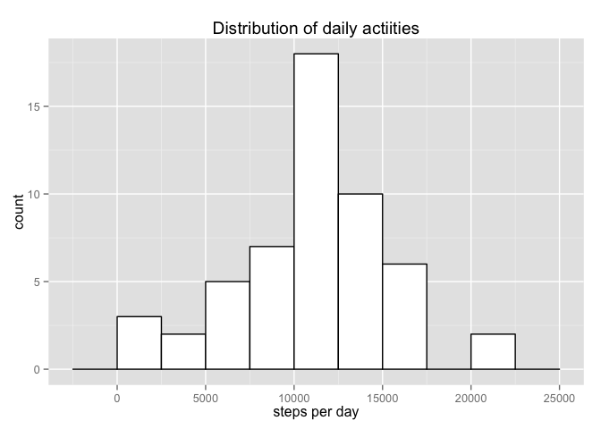
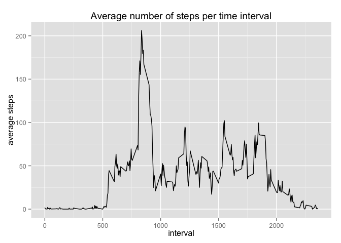
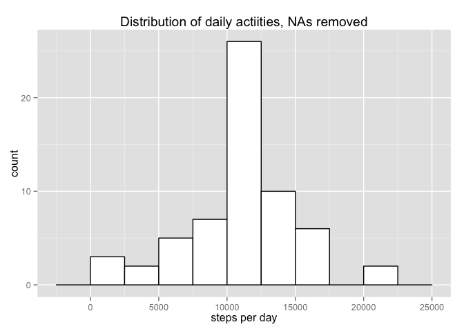
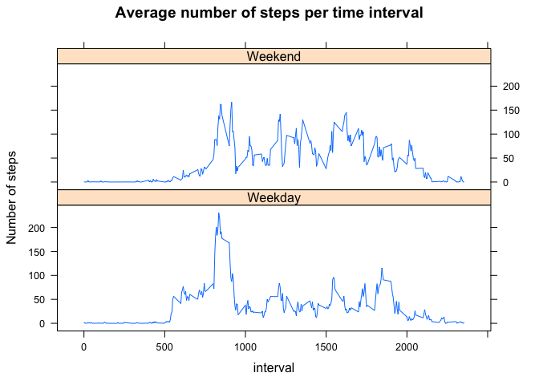

# Reproducible Research: Peer Assessment 1


## Loading and preprocessing the data
Begin by loading the data and changing the steps variable to a number.

```r
activity <- read.csv("activity.csv", header = T)
activity$steps <- as.numeric(activity$steps)
```

## What is mean total number of steps taken per day?

```r
library(ggplot2)
```

```
## Warning: package 'ggplot2' was built under R version 3.1.3
```

```r
library(dplyr)
```

```
## 
## Attaching package: 'dplyr'
## 
## The following object is masked from 'package:stats':
## 
##     filter
## 
## The following objects are masked from 'package:base':
## 
##     intersect, setdiff, setequal, union
```

```r
activityDF <- activity %>%
        group_by(date) %>%
        summarize(dateSums = sum(steps))
g <- ggplot(activityDF, aes(x = dateSums))
p <- g + geom_histogram(binwidth = 2500, fill = "white", colour = "black") +
        labs(title = "Distribution of daily actiities", x = "steps per day")
print(p)
```

 

```r
mean(activityDF$dateSums, na.rm = T)
```

```
## [1] 10766.19
```

```r
median(activityDF$dateSums, na.rm = T)
```

```
## [1] 10765
```

## What is the average daily activity pattern?

```r
dailyPattern <- activity %>%
        na.omit(activity) %>%
        group_by(interval) %>%
        summarize(averageSteps = mean(steps))
gAverage <- ggplot(dailyPattern, aes(x = interval, y = averageSteps))
pAverage <- gAverage + geom_line() + 
        labs(title = "Average number of steps per time interval", 
             y = "average steps")
print(pAverage)
```

 

```r
maxAverageSteps <- dailyPattern[dailyPattern$averageSteps == max(dailyPattern$averageSteps),]
maxAverageSteps
```

```
## Source: local data frame [1 x 2]
## 
##   interval averageSteps
## 1      835     206.1698
```


## Imputing missing values
To analyse missing values, I created a logical vector for the steps variable. This shows
that 2304 rows have NAs.

```r
##Missing values
NAvector <- is.na(activity$steps)
table(NAvector)
```

```
## NAvector
## FALSE  TRUE 
## 15264  2304
```

I then created a for loop in which I replaced every NA value in the steps variable with
the value for the average steps for that interval.

```r
##This code looks up NA values in the steps variable and replaces them with 
##average step values for the corresponding interval
dailyPatternDF <- data.frame(dailyPattern) ##must use dailyPattern as a dataframe
adjustedSteps <- numeric()##define a new, empty steps vector
##For every observation (row), I check to see if it is an NA value. 
##If it is, I replace the NA with the average number of steps for that interval.
##If it is not, I add the original steps value.
for(i in 1:length(NAvector)){
        if(NAvector[i] == TRUE){
                tempInterval <- activity$interval[i]
                tempSteps <- dailyPatternDF[dailyPatternDF$interval == tempInterval, 2]
        } else{
                tempSteps <- activity$steps[i]
        }
        adjustedSteps <- c(adjustedSteps, tempSteps)
        tempSteps <- numeric()
}
activityCleaned <- data.frame(adjustedSteps, activity[,2:3])
```


```r
activityCleanedDF <- activityCleaned %>%
        group_by(date) %>%
        summarize(dateSums = sum(adjustedSteps))
g2 <- ggplot(activityCleanedDF, aes(x = dateSums))
p2 <- g2 + geom_histogram(binwidth = 2500, fill = "white", colour = "black") +
        labs(title = "Distribution of daily actiities, NAs removed", x = "steps per day")
print(p2)
```

 

```r
mean(activityCleanedDF$dateSums)
```

```
## [1] 10766.19
```

```r
median(activityCleanedDF$dateSums)
```

```
## [1] 10766.19
```


## Are there differences in activity patterns between weekdays and weekends?

```r
##Differences in activity patters between weekdays and weekends
##Extract date information and create logical vector for weekends or not
Day <- as.Date(activityCleaned$date)
WeekDay <- weekdays(Day)
WeekEnd <- WeekDay == "Saturday" | WeekDay == "Sunday"
##Make a factor variable labeling each date as weekday or weekend
WeekDayFactor <- factor(!WeekEnd, levels = c("TRUE","FALSE"), 
                         labels = c("Weekday", "Weekend"))
activityCleaned$WeekDay <- WeekDayFactor
```


```r
dailyPatternCleaned <- activityCleaned %>%
        group_by(WeekDay, interval) %>%
        summarize(averageSteps = mean(adjustedSteps))
```


```r
library(lattice)
```

```
## Warning: package 'lattice' was built under R version 3.1.3
```

```r
xyplot(averageSteps ~ interval | WeekDay, data = dailyPatternCleaned, layout = c(1,2), 
       type = "a", ylab = "Number of steps", 
       main = "Average number of steps per time interval")
```

 
